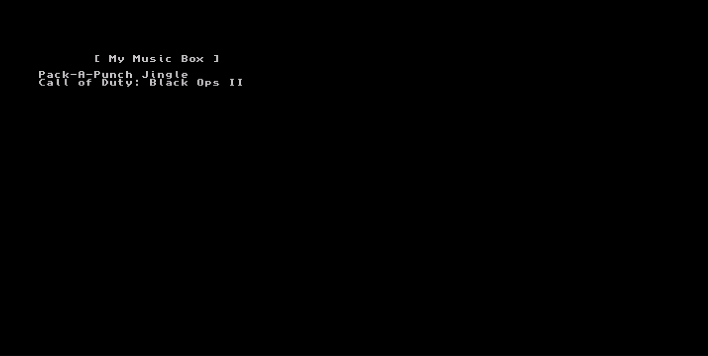
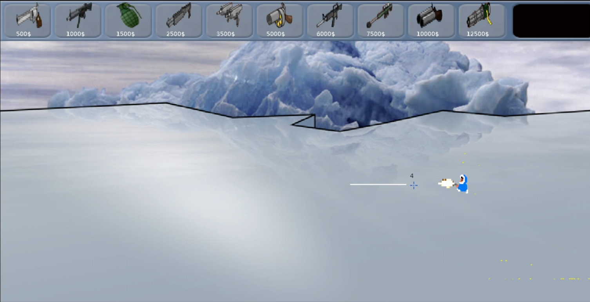
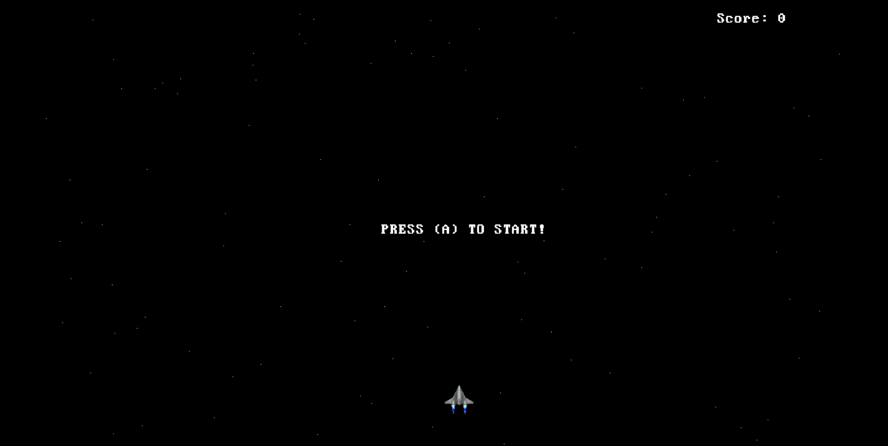
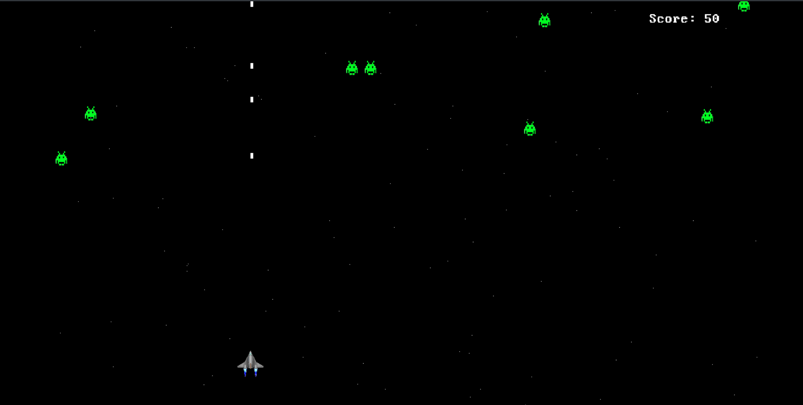
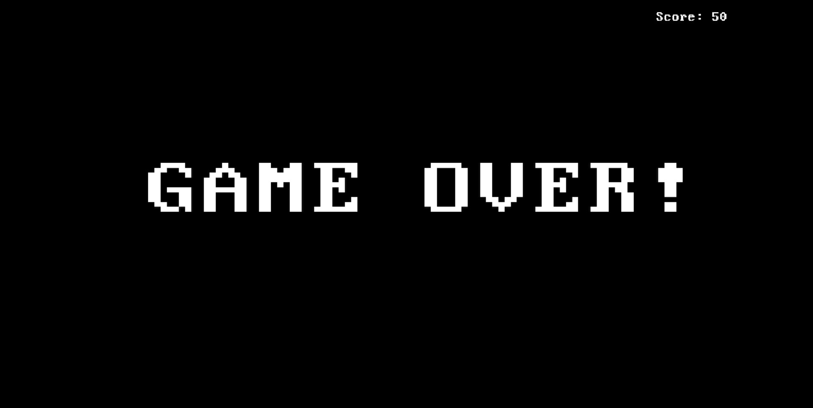

# NX_Homebrews
Nintendo Switch Homebrews\ 
all packages + source codes\
Developed by: Kenneth-van-der-Maazen\
Licensed by: Kenneth van der Maazen (C) 2025 - For Educational Purposes.
  
Downloading and or altering and or distributing the packages without my permission is allowed.\
However, I am not responsible for any damages that may be caused due to the useage of my packages.\
Nor can or will I be held accountable for any legal issues that may arise due to the useage of the software.\
You are responsible for your own actions.\
Use this repository for educational purposes and have fun!

